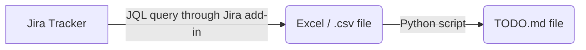

# **To Dos**

---

 

- TODO: XD75 QMK remap
    - This can serve as a reliable backup board to my usual split setup.
    - it's close enough to the original, while still staying portable
    - [ ] setup personal keyboard mappings folder in this project
    - [ ] figure out how to flash QMK to this keyboard, again...
    - [ ] remap the XD75 to a mapping that is as similar as possible to the Redox mapping
    - add o-rings?

- TODO: Redox QMK remap
- [ ] compile list of changes that I would make to the mapping.
    - [ ] figure out how to flash QMK to this keyboard, again...

------

- TODO: IDEA: "Jira tracker -> TODO.md sync process" :2023-07-04

---

 

- TODO figure out how to properly publish this package with `poetry` venv setup :2023-04-20
    - i.e.: with setup.py not in bare bones state
        - do I need to somehow automatically populate setup.py on commit with info from `pyproject.toml`?
    - [ ] to pypi
        - [ ] test installing from other venv
    - [ ] to github
        - [ ] test installing from other venv

 

### **In Progress...**

---

  

### **Low Priority**

---

 

- TODO: continue to add cleaning functions to [clean.py](fp_data_toolbox/clean.py) :2022-10-11
    - from `mtg-etl`
    - and from more abstract and general data cleaning ideas

- TODO improve [master .bat script](scripts/batch/_master_script.bat)
    - add more automatic orchestration to be run regularly

  
