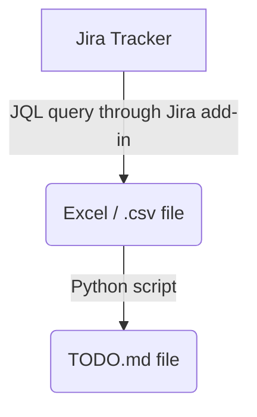

# **To Dos**

---

 

---

- TODO: IDEA: "Jira tracker -> TODO.md sync process" :2023-07-04

---

 

- TODO figure out how to properly publish this package with `poetry` venv setup :2023-04-20
    - i.e.: with setup.py not in barebones state
        - do I need to somehow automatically populate setup.py on commit with info from pyproject.toml?
    - [ ] to pypi
        - [ ] test installing from other venv
    - [ ] to github
        - [ ] test installing from other venv

 

- TODO: ML model pipeline :2023-03-05
    - setup simple, template for building and training Timeseries prediction model
    - ipynb notebook
    - based on notebook from professional project
    - [x] Using XGBoost to start
        - [ ] data analysis visualization before training
        - [ ] data cleaning
        - [ ] Feature creation
        - [ ] build/train
        - [ ] hyperparameter optimization

 

- TODO: Excel data sheet -> ydata report :2023-02-25
    - build and test out end 2 end process
    - [x] python function for opening sheet and loading to df
        - must take in workbook path and sheet names as variables
        - [x] develop
        - [x] test
    - [ ] python function for setting up ydata_config.yaml
        - based on professional version. should work the same
        - [ ] develop
            - [ ] some small changes to default config
        - [ ] test
    - [ ] simple python script orchestrating the following:
        - [x] develop
            - [x] takes in sys.args from .bat script
            - [x] load data from excel sheet using passed in variables
            - [x] load data into pandas df
            - [ ] cleaning / prep operations
            - [x] use data to generate ydata_profiling report
                - in same directory as excel file
        - [x] test
    - [x] VBA script for:
        - [x] develop
            - [x] passing variables to batch
            - [x] kicking off python
        - [x] test

### **In Progress...**

---

  

### **Low Priority**

---

 

- TODO: continue to add cleaning functions to [clean.py](fp_data_toolbox/clean.py) :2022-10-11
    - from `mtg-etl`
    - and from more abstract and general data cleaning ideas

- TODO improve [master .bat script](scripts/batch/_master_script.bat)
    - add more automatic orchestration to be run regularly

  
