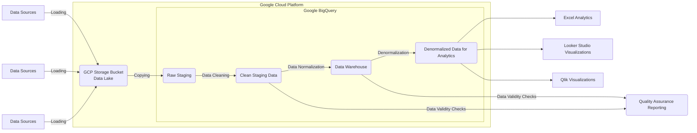

## Datavault modeling

I want to build a dataware house in GBQ with 'dbt' as the main orchestrator of transformations. I need a diagram that outlines the flow of data from source to final analytics / business insights. This should follow data modeling best practices and would help me to orient myself with the data pipeline.

Here are the steps that each data set should go through between data source and final analytics / business insights:

1. Loading data from 2-3 sources into a GCP storage bucket
2. Copying data from the storage bucket to a raw staging area in GBQ
3. transform the raw staging data into clean staging data in GBQ
4. transform the clean staging data into a normalized data warehouse format (star / snowflake schema)
5. transform the normalized data warehouse into a denormalized data format for various one-big-table servings of data to analytics users

Please help me with an initial iteration of a mermaid diagram that outlines the flow of data for this data model.

