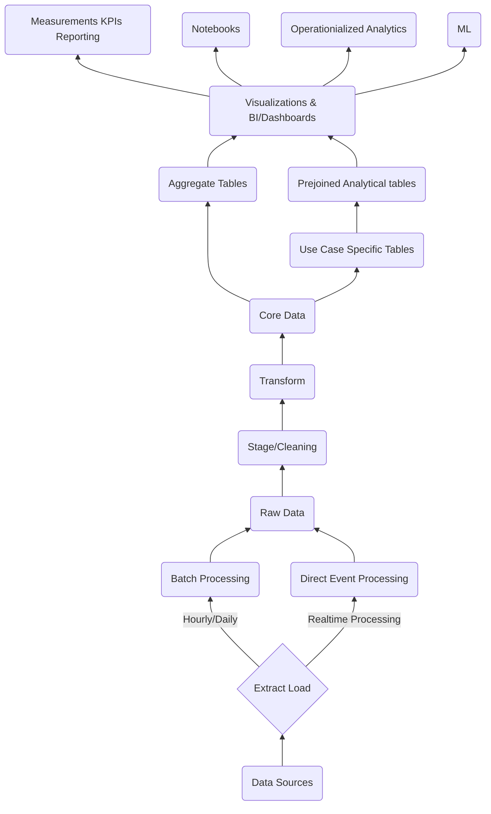

# Modern Data Stack (WIP)

```mermaid
graph BT
  DS(Data Sources)
  ETL{Extract Load}
  BP(Batch Processing)
  DEP(Direct Event Processing)
  RD(Raw Data)
  SC(Stage/Cleaning)
  T(Transform)
  CD(Core Data)
  AT(Aggregate Tables)
  UST(Use Case Specific Tables)
  PAT(Prejoined Analytical tables)
  V(Visualizations & BI/Dashboards)
  M(Measurements KPIs Reporting)
  N(Notebooks)
  OA(Operationialized Analytics)
  ML(ML)
  
  DS --> ETL
  ETL -->|Hourly/Daily| BP
  ETL -->|Realtime Processing| DEP
  BP --> RD
  DEP --> RD
  RD --> SC
  SC --> T
  T --> CD
  CD --> AT
  CD --> UST
  UST --> PAT
  AT --> V
  PAT --> V
  V --> M
  V --> N
  V --> OA
  V --> ML
```
