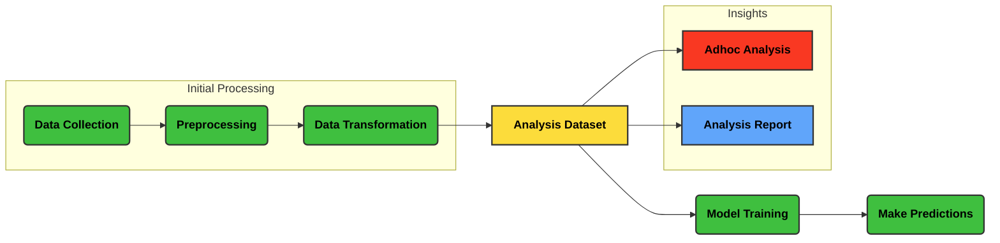

# data_flow_diagram

| Type           | Description                                  | Color       |
|----------------|----------------------------------------------|-------------|
| Process Nodes  | Nodes that represent processing steps       | 🟩 Green     |
| Custom Type 1  | Description for custom type 1 (e.g., Input) | 🟧 Orange    |
| Data Stored    | Nodes that represent data storage           | 🟨 Yellow    |
| Custom Type 3  | Description for custom type 3 (e.g., Flow)  | 🟦 Blue      |
| Analysis Nodes | Nodes that represent analysis operations    | 🟥 Red       |
| Custom Type 2  | Description for custom type 2 (e.g., Output)| 🟪 Purple    |

