# data_flow_diagram

| Type          | Description                                  | Color      |
| ------------- | -------------------------------------------- | ---------- |
| Process       | Nodes that represent processing steps        | 🟩 Green  |
| Custom Type 1 | Description for custom type 1 (e.g., Input)  | 🟧 Orange |
| Data Stored   | Nodes that represent data storage            | 🟨 Yellow |
| Reports       | Reporting                                    | 🟦 Blue   |
| Analysis      | Nodes that represent analysis operations     | 🟥 Red    |
| Custom Type 2 | Description for custom type 2 (e.g., Output) | 🟪 Purple |

```mermaid
graph LR;
%%%% Define Nodes
subgraph insights [Insights]
    analyze_adhoc[Adhoc Analysis]:::analysis
    ca_reporting[C&A Reporting]:::reporting
    reporting_full[Full Report]:::reporting
end

analytics_data[Full Analytics Data]:::data_stored
reporting_data[Full Reporting Data]:::data_stored
reporting_actuals_data[Reporting Actuals Data]:::data_stored
actuals_analysis[Analysis Actuals Data]:::data_stored
prediction[Future Predictions]:::data_stored
train(Model Training):::process

subgraph initial_processing [Initial Processing]
    transform(Data Transformation):::process
    preprocess(Preprocessing):::process
end
actuals_raw[Raw Actuals Data]:::data_stored
collect(Data Collection):::process

%%%% Define connections
actuals_analysis ----> reporting_actuals_data
analytics_data --> ca_reporting
analytics_data --> analyze_adhoc
actuals_analysis ----> analytics_data
reporting_data --> reporting_full
prediction ----> reporting_data
reporting_actuals_data --> reporting_data
prediction ----> analytics_data
train --> prediction
actuals_analysis --> train
transform --> actuals_analysis
preprocess --> transform
actuals_raw --> preprocess
collect --> actuals_raw

%%%% Define the styling for the diagram
classDef default fill:#C2C2C2,stroke:#333,stroke-width:2px,color:black,font-weight:bold;
%%%%
classDef data_interim fill:#F97316,stroke:#333,stroke-width:2px,color:black;
classDef data_stored fill:#FCDC3B,stroke:#333,stroke-width:2px,color:black;
classDef process fill:#3FBF3F,stroke:#333,stroke-width:2px,color:black;
classDef reporting fill:#60A5FA,stroke:#333,stroke-width:2px,color:black;
classDef analysis fill:#F93822,stroke:#333,stroke-width:2px,color:black;
```

